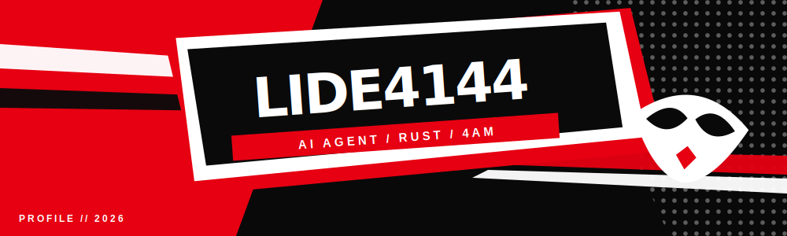
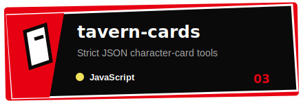
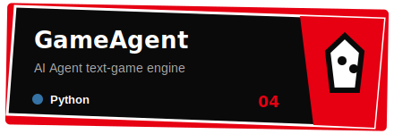
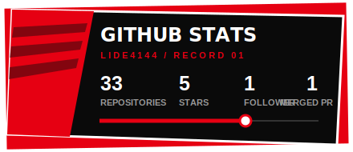
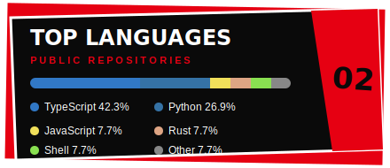

  
   
  

  
  
  

## 01 / PROFILE

- **lide4144** · CS 2026 · AI 应用开发工程师
- 专注 **AI Agent / LLM 工作流**，为 pi 生态构建工具与扩展
- ACM ICCSIT 2025 在册论文：*LLM Agents in Game Applications*
- 在做 SillyTavern 角色卡、文字游戏 / GalGame、RPG / 武侠生成器
- 常用 **TypeScript / Python / Rust / Termux**

## 02 / LOADOUT

  

## 03 / MISSIONS

  
  
  
  

  
<b>OPEN MISSION INDEX / 展开全部项目</b>

   

| AREA | REPOSITORIES |
|---|---|
| **AI / Agent** | [WritingAgent](https://github.com/lide4144/WritingAgent) · [pi-web-access](https://github.com/lide4144/pi-web-access) · [skills](https://github.com/lide4144/skills) · [my-llm-workflow](https://github.com/lide4144/my-llm-workflow) · [character-card-agent-system](https://github.com/lide4144/character-card-agent-system) |
| **SillyTavern** | [tavern-cards](https://github.com/lide4144/tavern-cards) · [SillyTavern-CharacterCard](https://github.com/lide4144/SillyTavern-CharacterCard) · [tavern-frontend-card](https://github.com/lide4144/tavern-frontend-card) · [tavern2agent](https://github.com/lide4144/tavern2agent) |
| **Games** | [GameAgent](https://github.com/lide4144/GameAgent) · [WUXIA](https://github.com/lide4144/WUXIA) · [RpgGame](https://github.com/lide4144/RpgGame) · [galgame](https://github.com/lide4144/galgame) |
| **RAG** | [RAG_Assistant](https://github.com/lide4144/RAG_Assistant) · [RAGSystem-](https://github.com/lide4144/RAGSystem-) · [RAG_System_back](https://github.com/lide4144/RAG_System_back) |
| **Tools** | [anki-tts-](https://github.com/lide4144/anki-tts-) · [context-mode-termux](https://github.com/lide4144/context-mode-termux) · [linux-xiaomi-raphael-uboot](https://github.com/lide4144/linux-xiaomi-raphael-uboot) |

## 04 / RECORDS

  
  
   
  

  

